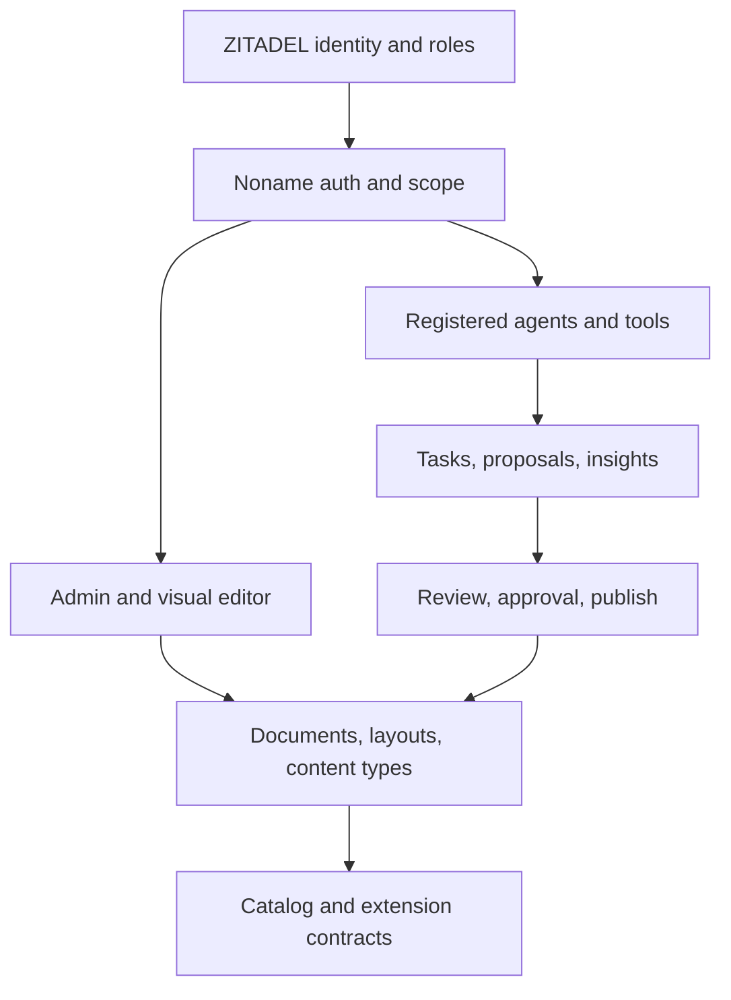
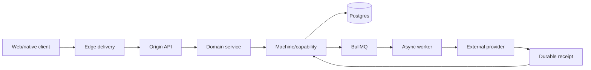
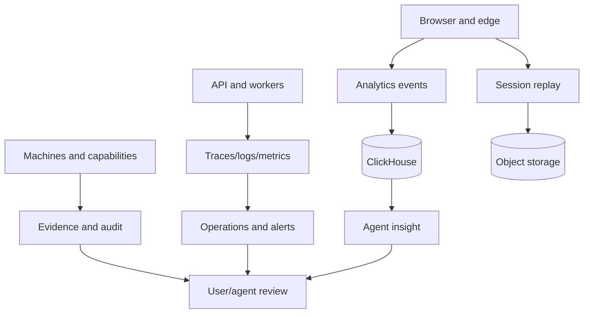

# Control planes, runtime, and observation

Noname becomes easier to reason about when the system is separated into control, runtime/data, and observation planes.

## Control plane

The control plane defines what the product is allowed to be and who can change it.



Control-plane data includes identity, permissions, content schemas, layout specs, agent registration, tool allowlists, feature configuration, and publish state.

## Runtime/data plane

The runtime plane serves users and performs durable work.



Runtime data includes documents, published versions, machine state/context, capability idempotency, provider receipts, order projections, and other domain state.

## Observation plane

The observation plane tells people and agents what happened.



## Why the separation matters

- A control-plane change can be reviewed before it affects runtime.
- Runtime data is not confused with analytics projections.
- Observation can explain failures without becoming the owner of business truth.
- Agents can analyze observation data while remaining constrained by control-plane permissions.

## Failure and alert model

A useful operational status includes:

```text
healthy
warning
blocked
retrying
failed
stale
requires-review
```

An alert should identify:

- what changed
- which tenant/product is affected
- first observed time
- evidence or trace ID
- current state
- suggested next action
- whether an agent may act automatically

## Related

- [Identity and integrations](./identity-and-platform-integrations)
- [Analytics and agent operations](../concepts/analytics-observability-agents)
- [Decision and evidence guide](./decision-and-evidence-guide)
