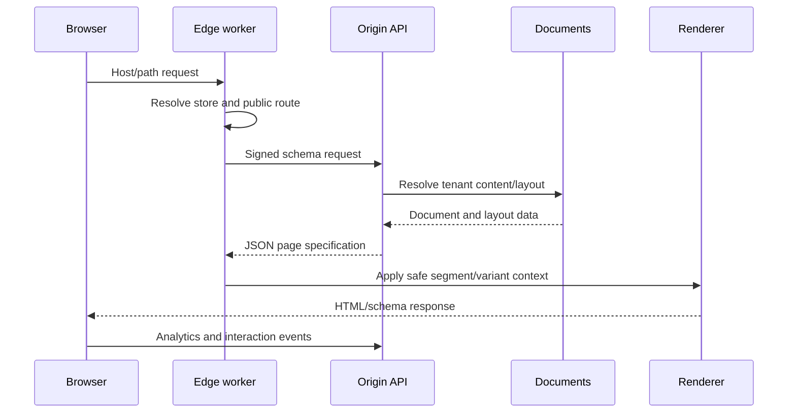
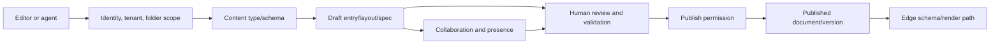
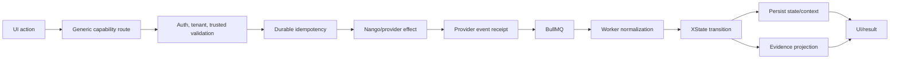
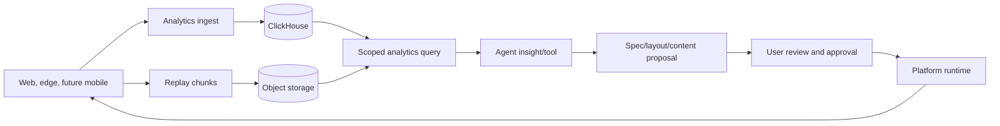

# Data flows and event flows

Architecture is easier to review as flows than as a list of packages. These diagrams show what moves, where it is validated, and where it becomes durable.

## Public page request



## CMS authoring and publishing



The agent may draft or propose. It does not bypass scope or publish permission.

## Durable workflow and provider event



## Analytics and agent optimization



ClickHouse is appropriate for append-heavy, high-volume analytical queries. It is not the source of truth for permissions, orders, machine state, or published content.

## Status and control events

Every important asynchronous path should make its state visible:

```text
requested
  → accepted
  → running
  → completed
  → failed/retryable
  → reviewed/applied where human approval is required
```

Agent tasks, provider receipts, machine instances, content drafts, and analytics jobs should not be represented as an unexplained spinner in the UI.

## Related

- [Control planes](./control-planes)
- [CMS and content platform](../concepts/cms-content-platform)
- [Analytics and agent operations](../concepts/analytics-observability-agents)
