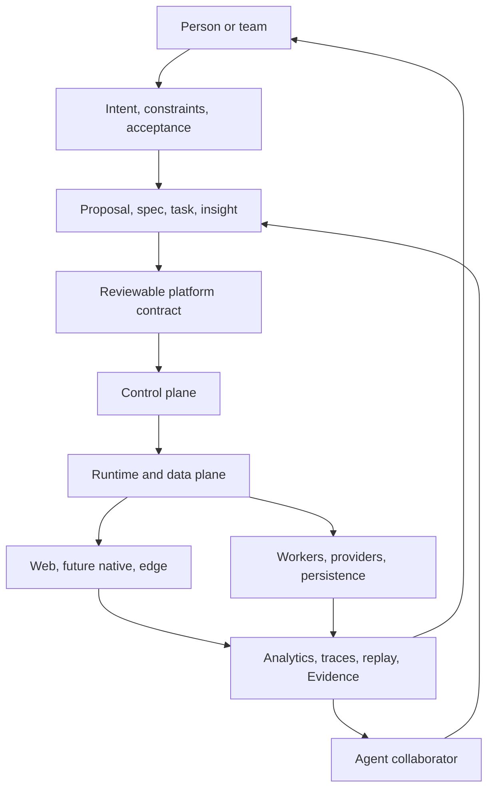

# Architecture overview

Read this page before package boundaries or individual ADRs. It explains the system as a set of flows and planes first; package ownership comes after the mental model.

## One-sentence model

Noname turns intent and declarative specifications into content, interfaces, workflows, integrations, and observable products while keeping people and agents in a reviewable build loop.

## System layers

## Read architecture in this order

1. [Architecture overview](./overview)
2. [Data flows](./data-flow)
3. [Control planes](./control-planes)
4. [Building an application](./building-an-application)
5. [Multi-surface rendering](./multi-surface-rendering)
6. [Identity and integrations](./identity-and-platform-integrations)
7. [Package boundaries](./package-boundaries)
8. [Architecture decisions](../decisions/ADR-0001-platform-as-contract)

## The three planes

| Plane | Question | Examples |
|---|---|---|
| Control | Who/what is allowed to define and change the system? | identity, permissions, specs, agents, admin/editor |
| Runtime/data | How does a user request become a result? | rendering, machines, capabilities, providers, persistence |
| Observation | What happened and how do we know? | analytics, traces, replay, alerts, Evidence |

## Scale principles

- Keep immutable specifications and durable state separate from request-scoped actors.
- Keep edge delivery fast and cacheable, but keep authorization and durable business meaning at the origin.
- Use ClickHouse for high-volume analytics queries, not transactional orders or permissions.
- Use queues and receipts for asynchronous provider effects.
- Use extension registries instead of forking generic platform clients.
- Make agent actions scoped, reviewable, and attributable.

## Related

- [Platform capability map](./platform-capability-map)
- [End-to-end runtime](./end-to-end-runtime)
- [Analytics and agent operations](../concepts/analytics-observability-agents)
