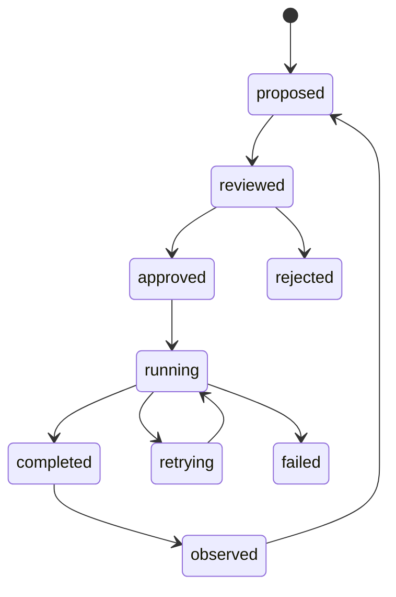

# Status, changes, and operational control

A platform that agents can operate needs more than logs. It needs an understandable status model and controlled change path.

## Change lifecycle

## Every change should answer

- Who or what proposed it?
- What tenant, product, page, or workflow does it affect?
- Which contract/specification changes?
- What permissions were used?
- What tests or previews passed?
- How can it be rolled back?
- What analytics or Evidence will show the result?

## Agent control

Agents should have:

- registered identity
- tenant scope
- tool allowlist
- task owner
- reviewer or approval policy
- status transitions
- trace/task identifiers
- visible result and failure details

## Alerts

Alerts should be actionable and evidence-linked, not simply “something failed.” A good alert includes context, current status, first-seen timestamp, affected scope, trace/task ID, and a safe next action.

## Related

- [Human-directed agent build loop](../decisions/ADR-0002-human-agent-build-loop)
- [Analytics and agent operations](../concepts/analytics-observability-agents)
- [Workers and deployment](../concepts/workers-and-deployment)
