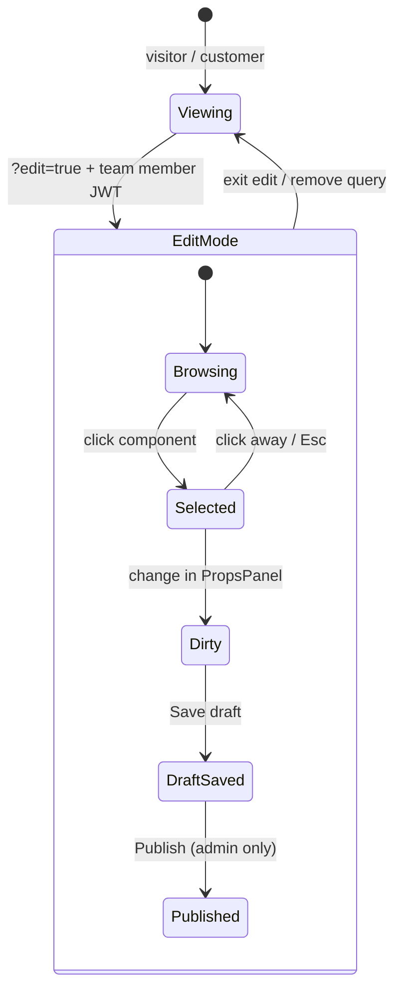

# Visual Editor UX — Google Docs–Style Editing on the Live Page

> **Date:** 2026-07-25  
> **Status:** Design target for Phase D visual editor  
> **Related:** [`VISUAL-EDITOR-PLAN.md`](./VISUAL-EDITOR-PLAN.md) (permissions first) · [`VISUAL_EDITOR.md`](../2026-07-11/VISUAL_EDITOR.md) (implementation)

---

## One-line summary

Merchants edit **what visitors see** — same URL, same components — by **clicking the thing on the page**, like Google Docs. Each click selects a **spec element**; changes write back to **layout JSON** and/or **CMS content**. Permissions follow a **Docs-like role model** (view / suggest / edit / manage).

---

## What we borrow from Google Docs (interaction, not chrome)

Google Docs UI is heavy (menus, ruler, comments). We take the **mental model**, not the pixel design.

| Google Docs idea | Our equivalent |
|------------------|----------------|
| **The page is the canvas** | Storefront at real URL (`/about`, product page) — not a separate builder |
| **Click to select** | Click Hero, ProductCard, Text block → selection ring + label |
| **Selection shows what you're editing** | `PropsPanel` (right) lists fields for **that** component only |
| **Mode switch** | Normal visit vs `?edit=true` (like View vs Edit; no second app) |
| **Suggesting vs editing** (optional later) | **Draft** save vs **Publish** — visitors see published only |
| **Sharing roles** | `visitor` / `customer` / `editor` / `admin` (see below) |
| **One source of truth** | Resolved spec on screen = what gets saved (no preview drift) |

What we **do not** copy: full menu bar, free-form paragraph flow, multi-user cursors in v1, comment threads (later).

Closer retail analogues: **Shopify theme editor** (click section), **Notion** (click block), **Figma** (select layer) — same “direct manipulation” family as Docs.

---

## Two admin surfaces (when to use which)

| Need | Surface | Why |
|------|---------|-----|
| Change **this page** as shoppers see it | `/{url}?edit=true` | WYSIWYG; click component |
| Bulk CMS, routing, auth, team | `/admin/*` | Tables, settings, JSON layout editor |

**Default for merchants:** open storefront → **Edit page** (adds `?edit=true`).  
**Power users:** `/admin/layout` for raw JSON when needed.

---

## Edit mode UI (zones)

Minimal chrome — page stays dominant (Docs keeps the document big too).

```
┌─────────────────────────────────────────────────────────────────────────┐
│  Save bar (sticky top)     [Draft saved · 2m ago]  [Discard] [Publish]  │  ← admin only: Publish
├─────────────────────────────────────────────────────────────────────────┤
│                                                                         │
│   ┌──────────────────────────────────────┐  ┌──────────────────────┐ │
│   │  LIVE PAGE (same Renderer)            │  │  PropsPanel (right)   │ │
│   │                                       │  │  "Hero Banner"        │ │
│   │   ╭─────────────────────────────╮     │  │  Title: [________]    │ │
│   │   │ Hero  ← hover: blue ring    │     │  │  CTA:   [________]    │ │
│   │   │      ← click: selected      │     │  │  Image: [Pick…]       │ │
│   │   ╰─────────────────────────────╯     │  │                       │ │
│   │                                       │  │  spec path:           │ │
│   │   [ ProductCard ]  [ Text ]           │  │  elements.hero        │ │
│   │                                       │  └──────────────────────┘ │
│   └──────────────────────────────────────┘                             │
│                                                                         │
└─────────────────────────────────────────────────────────────────────────┘
```

| Zone | Purpose |
|------|---------|
| **Page canvas** | Real catalog components; zero duplicate render tree |
| **Selection chrome** | Hover outline + component label chip (like Docs outline highlight) |
| **PropsPanel** | Form for selected element only — already started in `editor/props-panel.tsx` |
| **Save bar** | Draft / Publish / Discard — like Docs “Saving…” + explicit publish for storefront |

v1: edit via **panel fields**. v2: **inline text** on `Text` components (double-click → contenteditable) still writes the same spec/content paths.

---

## Click → spec element (the binding model)

Every visible block maps to **one node** in the json-render spec tree (and optionally a CMS row).

```
Visitor sees                    Merchant click selects
──────────                      ──────────────────────
<Hero title="Summer Sale"/>  →  spec.elements.hero
                                  type: "Hero"
                                  props: { title, ctaText, image }
                                  editPath: "elements.hero"

<ProductCard /> + CMS title  →  spec.elements.card
                                  + contentRef → content entry field "title"
                                  editPath: "elements.card"
                                  contentEdit: { entryId, field: "title" }
```

### Selection payload (internal)

When merchant clicks a component, edit mode stores:

```typescript
type EditSelection = {
  elementId: string;           // e.g. "hero"
  specPath: string;            // e.g. "elements.hero"
  componentType: string;       // e.g. "Hero"
  props: Record<string, unknown>;
  /** If prop came from edge $state / CMS merge */
  contentBinding?: {
    entryId: string;
    fieldKey: string;
  };
};
```

`PropsPanel` reads `catalog.components[componentType].edit.fields` and writes changes to:

- **Layout props** → patch layout document draft  
- **CMS-bound fields** → patch content entry draft (same as `/admin/content`)

One click, one panel — even when data spans layout + content (like Docs: one selection, one inspector).

---

## User flow (merchant edits a headline)

```
1. Merchant on https://yogastore.localhost/about
2. Clicks "Edit page" (or ?edit=true) — must be editor/admin JWT
3. Page reloads in edit mode; editor chunk lazy-loads
4. Hovers Hero → blue outline + "Hero Banner"
5. Clicks Hero → PropsPanel opens, title field focused
6. Types "Summer Sale 2026" → local dirty state (spec patch)
7. Save bar: "Unsaved changes"
8. [Save draft] → PUT layout draft (editor ✅)
9. [Publish]     → POST publish (admin ✅; editor sees disabled + tooltip)
10. Visitor refresh → sees new title (edge serves published)
```

Same flow as Docs: edit in place → auto/save draft → share/publish when ready — except **publish is explicit** so storefront never flashes draft content.

---

## Permission model (Docs-like roles)

Map Google Docs sharing to org team roles ([`VISUAL-EDITOR-PLAN.md`](./VISUAL-EDITOR-PLAN.md)):

| Google Docs | Our role | Sees edit chrome? | Can change content? | Can publish? |
|-------------|----------|-------------------|---------------------|--------------|
| Viewer | visitor / customer | No | No | No |
| Commenter | *(later)* | Optional | Comments only | No |
| Editor | **editor** | Yes | Yes (draft) | No (v1) |
| Owner | **admin** | Yes | Yes | Yes |

**Org-level config** — team roles target **ZITADEL Role Assignments** ([`TEAM-ROLES-ZITADEL.md`](./TEAM-ROLES-ZITADEL.md)); Postgres holds policy until migration. ZITADEL proves identity; store decides editor vs admin.

### What each role sees in edit mode

| UI element | editor | admin |
|------------|--------|-------|
| Hover/click outlines | ✅ | ✅ |
| PropsPanel | ✅ (all schema fields for bound content — scope via document/type, not field ACL) | ✅ |
| Save draft | ✅ | ✅ |
| Publish button | Hidden or disabled + “Ask an admin” | ✅ |
| Save bar “who can publish” hint | ✅ | — |

**Document-level access (not field ACL):** Restrict sensitive CMS data by splitting into separate content types/entries (e.g. `product_pricing` for admins only). Later: Zanzibar tuples for tag/collection scope. See [`FIELD-ACL.md`](../2026-08-01/FIELD-ACL.md).

---

## Mode diagram



---

## Spec + content: two layers, one UX

Merchants should not think in “layout JSON vs CMS” — the **click target** decides storage:

| Merchant action | Stored in | Example |
|-----------------|-----------|---------|
| Change button label on layout | `layout` spec `props.label` | Button component |
| Change product title on card | `content` entry `title` | ProductCard + `$state` |
| Change grid columns | `layout` spec `props.columns` | Grid component |

Edge resolve still merges content → spec for display; edit mode tracks **provenance** so save goes to the right document API.

---

## Entry points (product UX)

| Entry | Behavior |
|-------|----------|
| Storefront **“Edit page”** button | Visible only if session has `teamRole` editor/admin; sets `?edit=true` |
| Direct URL `?edit=true` | Edge + client gate; redirect login if anonymous |
| Admin **“Preview & edit”** on page list | Opens storefront URL in edit mode |
| `/admin/layout` JSON | Escape hatch — same documents, different UI |

---

## Shared permission + edit system (one backend, many UIs)

**Yes** — admin CMS, visual editor (`?edit=true`), and documents API must all call the **same** permission and edit pipeline. Merchants must not get different rules per screen.

```
                    ┌─────────────────────────────────┐
                    │  Check(user, relation, object)   │  ← ZITADEL JWT + tuples
                    │  Save / publish / op log         │  ← PERMISSIONS-REBAC.md
                    └─────────────────────────────────┘
                           ▲           ▲           ▲
                           │           │           │
              /admin/content   ?edit=true    API :3000/8787
              LayoutEntryAdmin  PropsPanel    (same guards)
```

| Surface | Same permission? | Same document writes? |
|---------|------------------|------------------------|
| `/admin/content` | ✅ | ✅ draft PUT + publish |
| `/admin/layout` | ✅ | ✅ |
| Visual editor | ✅ | ✅ same endpoints |
| Future mobile / API clients | ✅ | ✅ |

**Other people editing the same content** is a **separate UX layer** on top — not required for v1 permissions, but planned:

| Phase | Multi-editor UX | Backend |
|-------|-----------------|---------|
| **v1** | Solo edit; **409 conflict** if someone else saved first (“Refresh to see their changes”) | `If-Match: version` on draft |
| **v2** | **“Alice edited 2m ago”** on save bar; optional **access log** list | `document_ops` append-only log |
| **v3** | **Presence** (“Bob is editing”), live updates, cursors (Docs-like) | Op stream + eventual consistency |

v1 does **not** need avatars or live cursors — it **does** need one shared `Check()` so Bob cannot publish if he is only `editor`, whether he uses admin or visual editor.

See [`PERMISSIONS-REBAC.md`](./PERMISSIONS-REBAC.md) § consistency + op log for v2/v3.

---

## v1 vs later (UI scope)

| v1 (ship first) | Later |
|-----------------|-------|
| Click → PropsPanel | Double-click inline text on `Text` |
| Save bar draft/publish | Real-time co-editing |
| Single user dirty state | Undo stack / revision history UI |
| Core + commerce `edit` metadata | Comment/suggest mode |
| Right panel only | Floating toolbar on selection (Notion-style) |

---

## Implementation checklist (UX → code)

| UX requirement | Code home |
|----------------|-----------|
| Click selection | `editor/withEditing.tsx`, `editor/overlay.tsx` |
| Spec path on selection | `editor/useEditState.ts` |
| Panel fields | `editor/props-panel.tsx` ✅ |
| Save bar | `editor/save-bar.tsx` |
| Edit mode entry | `main.tsx` detects `?edit=true` |
| Role-gated chrome | Session `teamRole` + hide Publish for editor |
| Permission enforcement | Server Phase 0 in [`VISUAL-EDITOR-PLAN.md`](./VISUAL-EDITOR-PLAN.md) |

---

## References

- [`VISUAL-EDITOR-PLAN.md`](./VISUAL-EDITOR-PLAN.md) — permissions before UI  
- [`VISUAL_EDITOR.md`](../2026-07-11/VISUAL_EDITOR.md) — HOC, catalog `edit` metadata, deployment  
- [`CONTENT-RENDER-PIPELINE.md`](./CONTENT-RENDER-PIPELINE.md) — `$state` + CMS merge on edge  
- [`ADMIN-UI-LATER.md`](./ADMIN-UI-LATER.md) — form-based admin (companion surface)

---

*Interaction model: Google Docs–like direct manipulation on the live page. Visual style: minimal platform chrome (Save bar + PropsPanel), not a Docs clone.*
