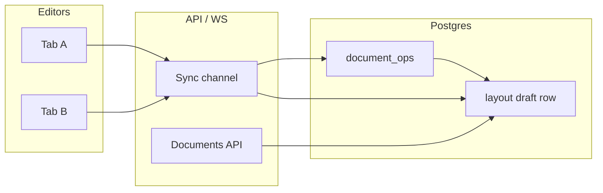

# Visual Editor — Collab & CRDT (deferred)

> **Date:** 2026-08-01 (updated 2026-08-06)  
> **Status:** Not building now — required later when **multiple people edit the same draft at the same time**  
> **Implementation spec (E3):** [`E3-LIVE-CRDT-COLLAB-IMPLEMENTATION.md`](../2026-08-06/E3-LIVE-CRDT-COLLAB-IMPLEMENTATION.md) — OSS cheat sheet, stack choice, phases  
> **Related:** [`VISUAL-EDITOR-GAP-ANALYSIS.md`](./VISUAL-EDITOR-GAP-ANALYSIS.md) · [`VISUAL-EDITOR-IMPLEMENTATION-ORDER.md`](../2026-07-25/VISUAL-EDITOR-IMPLEMENTATION-ORDER.md) · [`PERMISSIONS-OSS-REFERENCES.md`](../2026-07-25/PERMISSIONS-OSS-REFERENCES.md)

---

## Short answer

**Yes — live collab (CRDT / op sync) becomes necessary when more than one person is working on the same page draft concurrently**, not when a single merchant wants undo on another device.

| Need | Solution | When |
|------|----------|------|
| Undo mistakes in **this tab**, before save | Client history stack | **Shipped** |
| Two tabs / two people **save** at different times | `If-Match` + **409** + refresh | **Shipped** |
| Two people **editing live** (see each other, no save conflict) | CRDT / op stream + presence | **Later (v3)** |
| Undo on **another device** after closing the laptop | Server `document_ops` or synced draft | **Later (v2 audit path)** |
| Rich-text fields edited **simultaneously** (long description) | **Yjs** + TipTap/Hocuspocus | **Later — only if product asks** |
| Layout **spec tree** edited **simultaneously** | **Automerge** (or similar JSON CRDT) | **Later — after op log + spike** |

Do **not** add CRDT until simultaneous multi-editor is a real product requirement. Solo merchants + occasional 409 on save is enough for a long time.

---

## What we have today (v1 / post-v1 slice)

1. **Session undo/redo** — in-memory stack over layout spec + content fields + pending block; cleared on save, publish, discard, refresh. Same-tab only.
2. **Optimistic save conflict** — layout PUT sends `If-Match: "<updatedAt>"`; server returns **409** if someone else saved first; editor shows refresh banner.
3. **Solo edit** — no presence, no live cursors, no shared undo.

That matches [`VISUAL-EDITOR-UX.md`](../2026-07-25/VISUAL-EDITOR-UX.md) v1: *solo edit + conflict at save boundary*.

---

## When CRDT / live collab becomes necessary

Build Phase 3 collab when **all** of these are true:

1. **Product** — merchants expect Google Docs–style editing (presence, no “refresh to see their changes” during edit).
2. **Usage** — multiple editors on the **same layout draft** at the **same time** is common (agency + client, two admins, content + design roles).
3. **Foundation** — tenant/org sharing and document permissions are stable (simpler tenant model, clear `editor` on document tuples). Collab on top of messy ACLs is expensive.
4. **v2 stepping stones shipped** — `document_ops` audit log + patch payloads (see below).

Until then, **409 + client undo** scales fine: each editor works alone; last writer wins only at save time, with an explicit conflict message.

---

## Phased path (do not skip steps)

From [`VISUAL-EDITOR-IMPLEMENTATION-ORDER.md`](../2026-07-25/VISUAL-EDITOR-IMPLEMENTATION-ORDER.md):

```
v1  Client undo + If-Match 409     ← current
v2  document_ops op log             ← audit, ordering, cross-session history (not live merge yet)
v2  Automerge offline spike         ← prove two spec edits merge cleanly
v3  Automerge + sync transport      ← live layout spec collab
v3  Yjs + Hocuspocus (optional)     ← rich-text fields ONLY if required
```

### v2 — `document_ops` (before CRDT)

Append-only log per document:

- `server_version`, client op id, user, timestamp
- Payload: **JSON Patch** or dot-path overrides ([`SPEC-STORAGE-MERGE.md`](../2026-07-25/SPEC-STORAGE-MERGE.md)), not full spec every time
- Enables: audit (“Alice edited 2m ago”), cross-device **history**, replay — still not live merge

Client undo can stay local; server log is for audit and future sync.

### v3 — Layout spec: Automerge (CRDT), not Yjs

json-render **spec trees** are arbitrary JSON graphs (elements, props, children). Prefer:

- **[Automerge](https://github.com/automerge/automerge)** — Map/List CRDT fit for structured JSON
- **Not** whole-document Yjs for the spec (Yjs is optimized for text/arrays, not arbitrary graphs)

Spike (step 7): two offline clients edit different paths → merge → identical spec.

### v3 — Rich text only: Yjs + Hocuspocus

If two merchants must edit the **same CMS long-text field** live:

- TipTap + `@tiptap/extension-collaboration` + **Hocuspocus** WebSocket
- **Do not** use this for Hero/layout/grid — use Automerge for spec

See [`PERMISSIONS-OSS-REFERENCES.md`](../2026-07-25/PERMISSIONS-OSS-REFERENCES.md) § Collaborative editing.

---

## Architecture sketch (v3)



- **Draft row** — canonical snapshot at rest (publish boundary unchanged).
- **Op stream** — CRDT updates or ordered ops between snapshots.
- **Publish** — still a full validated spec replace + permission check (strong convergence at publish).

Consistency model: [`PERMISSIONS-REBAC.md`](../2026-07-25/PERMISSIONS-REBAC.md) — eventual consistency while editing, strong convergence at publish.

---

## What not to do early

| Anti-pattern | Why |
|--------------|-----|
| CRDT for undo-only / cross-device undo | Overkill; `document_ops` replay or autosaved draft is enough |
| Yjs on full layout spec | Poor fit for json-render graph |
| Live collab before 409 + permissions stable | Conflicts and ACL bugs multiply |
| CRDT before Automerge spike | Merge semantics on spec paths must be proven offline first |

---

## Triggers to schedule collab work

| Signal | Action |
|--------|--------|
| Support tickets: “we overwrite each other constantly **while** editing” | Prioritize v3 collab |
| Support: “I saved and lost their work” only | **409 + comms** — collab not required yet |
| Agency tier: 3+ editors on one storefront daily | Plan `document_ops` + Automerge spike |
| Inline long-text editing (D7) + two editors on description | Evaluate Hocuspocus slice |

---

## Doc map

| Question | Read |
|----------|------|
| Current editor gaps & shipped post-v1 | [`VISUAL-EDITOR-GAP-ANALYSIS.md`](./VISUAL-EDITOR-GAP-ANALYSIS.md) |
| Implementation sequence (steps 6–10) | [`VISUAL-EDITOR-IMPLEMENTATION-ORDER.md`](../2026-07-25/VISUAL-EDITOR-IMPLEMENTATION-ORDER.md) |
| Automerge vs Yjs vs op log | [`PERMISSIONS-OSS-REFERENCES.md`](../2026-07-25/PERMISSIONS-OSS-REFERENCES.md) |
| Tuple model + consistency | [`PERMISSIONS-REBAC.md`](../2026-07-25/PERMISSIONS-REBAC.md) |
| Patch / merge storage | [`SPEC-STORAGE-MERGE.md`](../2026-07-25/SPEC-STORAGE-MERGE.md) |

---

*CRDT is a **simultaneous multi-editor** feature, not a replacement for client undo. Ship collab only after tenant sharing is simple and real usage shows editors stepping on each other during edit — not just at save.*
