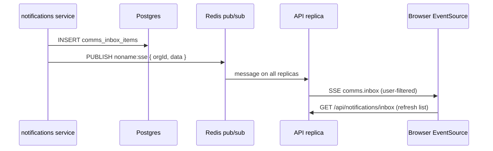

# In-app inbox + SSE live updates

**Status:** Implemented in code (I-c.4). Requires ops batch (`db:push`, reseed) before live smoke test.

## What it is

Per-user, per-org notification center backed by `comms_inbox_items`. Same table and API for:

| Surface | URL | Layout template |
|---------|-----|-----------------|
| Admin | Integrations → **In-app inbox** | `admin_integrations` / `CommsInboxAdmin` |
| Storefront account | `/account/notifications` | `account_notifications` / `AccountNotificationsInbox` |

Channels are independent per trigger (`email`, `in_app`, `sms`). In-app writes a row and pushes a live event; email/SMS use the delivery worker.

This is **not** comms delivery analytics (opens/clicks). See [COMMS-DELIVERY-ANALYTICS.md](./COMMS-DELIVERY-ANALYTICS.md).

---

## Data flow



1. `notify()` with `in_app` channel inserts an inbox row.
2. `broadcast(orgId, { type: "comms.inbox", userId, item })` publishes to Redis channel `noname:sse`.
3. Every API process subscribes once (`initSseManager`) and writes to local SSE clients for that org.
4. Clients connected to `GET /api/notifications/stream` receive the event and refetch the inbox list.

---

## Redis role

Redis is **only** for cross-replica fan-out. Each API process keeps an in-memory map of open SSE streams:

```
orgId → streamId → { stream, userId? }
```

| Piece | Location |
|-------|----------|
| Pub/sub channel | `noname:sse` |
| Publisher | `sse-manager.broadcast()` |
| Subscriber | `initSseManager()` on server boot |
| Local delivery | `broadcastLocal()` → `stream.writeSSE()` |

If Redis is down, `broadcast()` falls back to local-only delivery (fine for single-replica dev).

**User scoping:** When `data.userId` is set (inbox events), only SSE clients registered with the same `userId` receive the event. Org-wide events (e.g. feature flags) omit `userId` and go to all org streams.

---

## SSE endpoint

```
GET /api/notifications/stream
```

- Requires org context (`x-org-id` / edge HMAC) and authenticated user.
- Auth: `Authorization: Bearer …` **or** `?access_token=…` (EventSource cannot set headers).
- Heartbeat every 30s (`{ type: "heartbeat" }`).
- Initial `{ type: "connected", userId }`.

### Why query-token for EventSource?

Browsers do not allow custom headers on `EventSource`. Options we considered:

| Approach | Pros | Cons |
|----------|------|------|
| **Query JWT** (current v1) | Trivial; works with existing ZITADEL access token | Token may appear in access logs; use short-lived tokens in prod |
| Cookie-only auth on stream | No token in URL | Requires stream route to read cookie; prod cookie domain policy |
| **Stream ticket** (POST mint, 60s TTL) | Best security | Extra round-trip; implement when hardening prod |

Client hook: `packages/client/src/core/hooks/useCommsInboxStream.ts` — opens EventSource with `access_token` query param, refetches inbox on `comms.inbox` for the signed-in user.

Admin and account inbox both use `CommsInboxPanel` (SSE, no 30s polling).

---

## REST inbox API

| Method | Path | Notes |
|--------|------|-------|
| GET | `/api/notifications/inbox` | `?unreadOnly=true&limit=50` |
| POST | `/api/notifications/inbox/:id/read` | Marks read, returns row |

Scoped to authenticated user + org (not integrations admin permission).

---

## Related files

| Area | Path |
|------|------|
| Service + broadcast | `packages/server/src/domains/notifications/service.ts` |
| SSE manager | `packages/server/src/shared/sse-manager.ts` |
| Stream route | `packages/server/src/domains/notifications/routes/stream.ts` |
| Shared UI | `packages/client/src/core/components/CommsInboxPanel.tsx` |
| Storefront page | `packages/client/src/core/components/AccountNotificationsInbox.tsx` |
| Routing | `packages/client/src/platform-routes.ts` → `account_notifications` |

---

## Future (not v1)

- Mobile push channel (FCM/APNs) — separate adapter, same trigger config pattern.
- Stream ticket endpoint instead of raw JWT in query string (edge query-token forwarding shipped 2026-08-05 — see E2E F8).
- Optional Redis channel per user (`noname:sse:{orgId}:{userId}`) if org-wide fan-out becomes noisy at scale.
