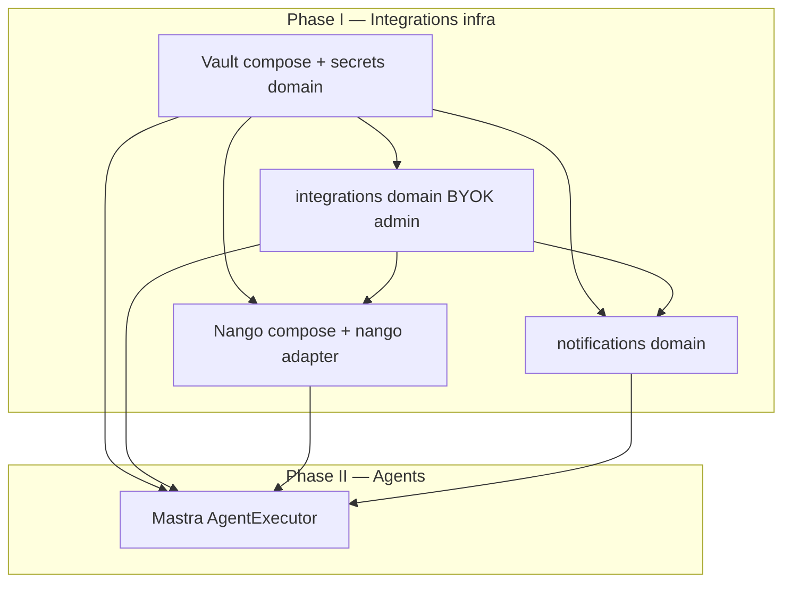

# Build roadmap — Vault, integrations, Nango, then agents (Mastra)

> **Date:** 2026-08-04  
> **Status:** Approved build order (docs first; implement in sequence)  
> **Rule:** Do **integrations + secrets infrastructure** before **Mastra multi-step agents**.

**Related:** [`VAULT-CLIENT-SECRETS.md`](./VAULT-CLIENT-SECRETS.md) · [`PLATFORM-PALETTE-SECRETS-NOTIFICATIONS.md`](./PLATFORM-PALETTE-SECRETS-NOTIFICATIONS.md) · [`LLM-CREDENTIALS-PER-ORG.md`](../2026-08-03/LLM-CREDENTIALS-PER-ORG.md) · [`nango-domain.md`](../2026-07-04/nango-domain.md) · [`AGENT-PHASE-2-MASTRA-SPEC.md`](../2026-08-03/AGENT-PHASE-2-MASTRA-SPEC.md)

---

## Why this order

Agents need **resolved credentials** and **external API connections** before Mastra can call tools safely.

```
Phase 1 — Infrastructure          Phase 2 — Agents
────────────────────────          ─────────────────
Vault + secrets domain      →     Mastra loop in AgentExecutor
integrations admin (BYOK)   →     Tools: CMS, analytics, …
notifications (comms)       →     Tool: Nango (Gmail, Stripe, …)
Nango + OAuth connections   →     resolveLLM via Vault per org
```

**Do not** start Mastra until Phase 1 **I-a through I-d** are at least minimally wired (Vault + LLM resolve + Nango connect path).

---

## Secret homes (unchanged)

| Store | Holds |
|-------|--------|
| **ZITADEL** | Human login IdP secrets |
| **Vault** | LLM BYOK, comms BYOK, platform keys |
| **Nango** | OAuth tokens (Stripe, Shopify, Gmail, …) |
| **Postgres `app`** | Flags, `connectionId`, CMS, prefs — **no raw secrets** |

---

## Domain layout (backend)

Mirror **`domains/auth`** + `adapters/zitadel`:

```
packages/server/src/domains/
  secrets/                    # Phase I-a — Vault only
    ports.ts                  # SecretStorePort
    service.ts                # paths, resolveLLM, resolveComms
    adapters/vault.ts
    index.ts

  integrations/               # Phase I-b, I-d — admin + Nango
    ports.ts                  # IntegrationOAuthPort (Nango)
    service.ts                # saveLlmKey, saveCommsKey, connectSession
    adapters/nango.ts         # @nangohq/node
    routes/llm.ts
    routes/comms.ts
    routes/nango.ts           # connect session, webhooks
    index.ts

  notifications/              # Phase I-c
    ports.ts                  # NotificationPort (send)
    service.ts
    adapters/resend.ts        # uses secrets.service.resolveComms
    index.ts

  ai-pipeline/                # existing — switch to secrets.service
  agent/                      # Phase II — Mastra (see Mastra spec)
    mastra/                   # runtime, tools, guards
```

**Secrets domain** = low-level get/put Vault.  
**Integrations domain** = merchant admin API (write-only BYOK + Nango connect).  
**Notifications** = send; never stores keys.  
**Agent** = consumes `resolveLLMProvider` + Nango tools via integrations adapter.

---

## Phase I-a — HashiCorp Vault + `domains/secrets`

### Docker (dev = prod pattern)

Add to `docker-compose.yml`:

| Service | Image | Port | Notes |
|---------|--------|------|--------|
| **vault** | `hashicorp/vault` | `8200` | Dev server mode; root token in `.env` for local only |

Env (server):

```env
VAULT_ADDR=http://localhost:8200
VAULT_TOKEN=dev-root-token          # dev only
VAULT_MOUNT=secret
VAULT_PATH_PREFIX=noname
```

Init script (once): enable KV v2 at `secret/`, seed `noname/platform/*` dev keys.

### Code deliverables

- [ ] `SecretStorePort` + `VaultSecretStore`
- [ ] `createSecretsDomain(deps)` wired in `server/index.ts`
- [ ] `resolveLLMProvider(orgId)` moved from env-only to Vault paths
- [ ] `llm_usage` append on each call
- [ ] No `org_secrets` Postgres table

### Prod

- Vault HA or HCP Vault; AppRole/K8s auth (no root token in apps)
- Same `VaultSecretStore`, different auth config

**Doc:** [`VAULT-CLIENT-SECRETS.md`](./VAULT-CLIENT-SECRETS.md)

---

## Phase I-b — `domains/integrations` (admin BYOK)

**Before agents.** Merchants configure keys from admin UI.

### Admin UI (client)

| Screen | Action |
|--------|--------|
| **Integrations → LLM** | Paste OpenAI/Anthropic key; provider; platform fallback toggle |
| **Integrations → Comms** | Paste Resend/Twilio; from-address |
| **Integrations → Connections** (I-d) | Connect Stripe / Gmail via Nango |

### API (server)

| Method | Route | Effect |
|--------|-------|--------|
| GET | `/api/.../integrations/llm` | Flags only |
| PUT | `/api/.../integrations/llm` | Keto → `secrets.putOrgSecret` → update `tenant_settings` |
| GET/PUT | `/api/.../integrations/comms` | Same for comms |

Pattern: copy **auth config** write-only UX ([`ORG-AUTH-CONFIG.md`](../2026-07-25/ORG-AUTH-CONFIG.md)).

### Code deliverables

- [ ] `createIntegrationsDomain({ secrets, documents, auth })`
- [ ] Keto permission e.g. `integrations:manage`
- [ ] Client forms + seed layout `admin_integrations`
- [ ] `ai-pipeline/providers.ts` uses `secrets.resolveLLMProvider`

---

## Phase I-c — `domains/notifications`

Depends on **I-a** (comms keys in Vault).

- [ ] `NotificationPort` + Resend/Twilio adapter
- [ ] `comms_deliveries` table
- [ ] `notification_preferences` (per user)
- [ ] BullMQ `email-outbound` worker: CMS template → render → send
- [ ] Admin comms settings wired in I-b

**Doc:** [`PLATFORM-PALETTE-SECRETS-NOTIFICATIONS.md`](./PLATFORM-PALETTE-SECRETS-NOTIFICATIONS.md)

---

## Phase I-d — Nango docker + `integrations/adapters/nango`

### Docker

Add profile `integrations`:

| Service | Port | Deps |
|---------|------|------|
| **nango** | `3003`, `3009` | Postgres DB `nango`, Dragonfly, `NANGO_ENCRYPTION_KEY` from Vault |

Server env: `NANGO_HOST`, `NANGO_SECRET_KEY` (from Vault platform path in prod).

### Integrations ↔ Nango

| Flow | Steps |
|------|--------|
| **Connect** | Admin UI → `POST .../integrations/nango/session` → headless or Connect UI → webhook → save `connectionId` |
| **Agent tool** | `nango.triggerAction(provider, connectionId, action, input)` |
| **MCP (optional)** | Nango `/mcp` with connection headers for Mastra tools |

Postgres only:

```typescript
integrations: {
  stripe?: { connectionId: string };
  googleMail?: { connectionId: string };
}
```

**Doc:** [`nango-domain.md`](../2026-07-04/nango-domain.md)

### Code deliverables

- [ ] `NangoAdapter` implementing `IntegrationOAuthPort`
- [ ] Webhook route for connection created
- [ ] Admin “Connect Stripe/Gmail” buttons
- [ ] No OAuth tokens in Vault or Postgres

---

## Phase II — Agents + Mastra (after I-a … I-d)

**Prerequisite:** `resolveLLMProvider(orgId)` works; at least one Nango connection type tested.

### What Mastra adds

Replace inline `AgentExecutor` switch with **Mastra agent loop** ([`AGENT-PHASE-2-MASTRA-SPEC.md`](../2026-08-03/AGENT-PHASE-2-MASTRA-SPEC.md)):

```
BullMQ agent-tasks
  → agent/worker.ts
  → Mastra runtime (packages/server/src/domains/agent/mastra/)
      tools:
        - generate_layout / generate_content (documents)
        - analyze_analytics
        - nango_trigger (uses connectionId from tenant_settings)
      guards: Keto + agent permissions
      LLM: resolveLLMProvider(orgId) — Vault BYOK or platform key
  → task.output { steps[], artifacts[], summary, tokens }
  → owner/admin review (existing)
```

### Mastra dependency

```json
"@mastra/core": "<pinned>"
```

Wire in `server/index.ts`:

```typescript
const executor = createMastraExecutor({ secrets, integrations, documents, agent, … });
```

### Agent tools that need integrations

| Tool | Credential source |
|------|-------------------|
| LLM calls | **Vault** via `secrets.service` |
| Send email (transactional) | **notifications** domain (Vault comms) |
| Gmail / Drive / Stripe API | **Nango** `connectionId` |
| CMS writes | Agent JWT + Keto (existing) |

**Do not** pass raw API keys into Mastra context — tools call server ports only.

---

## Dependency graph



---

## Implementation checklist (copy for PRs)

### I-a Vault + secrets
- [ ] docker-compose: `vault` service
- [ ] `domains/secrets/*`
- [ ] `ai-pipeline` uses resolver
- [ ] `.env.example`: `VAULT_*`

### I-b Integrations admin
- [ ] `domains/integrations/routes/llm|comms`
- [ ] Client admin forms
- [ ] `tenant_settings.integrations` types

### I-c Notifications
- [ ] `domains/notifications/*`
- [ ] `email-outbound` worker

### I-d Nango
- [ ] docker-compose: `nango` profile
- [ ] `integrations/adapters/nango.ts`
- [ ] Connect + webhook routes

### II Mastra agents
- [ ] `@mastra/core`
- [ ] `agent/mastra/*`
- [ ] Tool: `nango_trigger`
- [ ] Client step timeline (Mastra spec § client)

---

## What we are NOT building

- ❌ Noti as separate service
- ❌ `org_secrets` Postgres table (Vault only)
- ❌ LLM keys in Nango (Vault for BYOK; Nango for OAuth apps)
- ❌ Mastra before Vault + integrations baseline

---

## FAQ

**Can we ship LLM BYOK before Nango?**  
Yes — I-a + I-b + partial I-c is enough for agents on platform LLM keys.

**Can we ship Nango before notifications?**  
Yes — I-d can parallel I-c if comms not needed yet.

**When does Mastra start?**  
After I-a and I-b; I-d required only if agent tools call external OAuth APIs.

**Dev without Vault container?**  
Prefer Vault in compose for parity; optional env fallback only for emergency local hack, not documented prod path.
