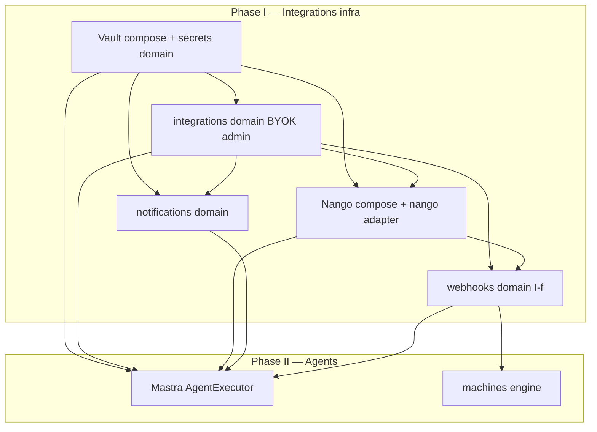

# Build roadmap — Vault, integrations, Nango, then agents (Mastra)

> **Date:** 2026-08-04  
> **Status:** Approved build order (docs first; implement in sequence)  
> **Rule:** Do **integrations + secrets infrastructure** before **Mastra multi-step agents**.

**Related:** [`VAULT-CLIENT-SECRETS.md`](./VAULT-CLIENT-SECRETS.md) · [`PLATFORM-PALETTE-SECRETS-NOTIFICATIONS.md`](./PLATFORM-PALETTE-SECRETS-NOTIFICATIONS.md) · [`LLM-CREDENTIALS-PER-ORG.md`](../2026-08-03/LLM-CREDENTIALS-PER-ORG.md) · [`nango-domain.md`](../2026-07-04/nango-domain.md) · [`AGENT-PHASE-2-MASTRA-SPEC.md`](../2026-08-03/AGENT-PHASE-2-MASTRA-SPEC.md)

---

## Why this order

Agents need **resolved credentials** and **external API connections** before Mastra can call tools safely.

```
Phase 1 — Infrastructure          Phase 2 — Agents
────────────────────────          ─────────────────
Vault + secrets domain      →     Mastra loop in AgentExecutor
integrations admin (BYOK)   →     Tools: CMS, analytics, …
notifications (comms)       →     Tool: integrations (external APIs)
OAuth connections (I-d)     →     resolveLLM via Vault per org
webhooks (I-f)              →     async events → machines / outbound URLs
```

**Do not** start Mastra until Phase 1 **I-a through I-d** are at least minimally wired (Vault + LLM resolve + OAuth connect path). Add **I-f (webhooks)** before machines or agents depend on **async external events** (payment succeeded, order created, etc.).

---

## Secret homes (unchanged)

| Store | Holds |
|-------|--------|
| **ZITADEL** | Human login IdP secrets |
| **Vault** | LLM BYOK, comms BYOK, platform keys |
| **Nango** | OAuth tokens for any integration enabled in your Nango environment |
| **Postgres `app`** | Flags, `connectionId`, CMS, prefs, webhook subscriptions — **no raw secrets** |

---

## Domain layout (backend)

Mirror **`domains/auth`** + `adapters/zitadel`:

```
packages/server/src/domains/
  secrets/                    # Phase I-a — Vault only
    ports.ts                  # SecretStorePort
    service.ts                # paths, resolveLLM, resolveComms
    adapters/vault.ts
    index.ts

  integrations/               # Phase I-b, I-d — admin BYOK + OAuth connect
    ports.ts                  # IntegrationOAuthPort
    service.ts                # saveLlmKey, saveCommsKey, connectSession, triggerOAuthAction
    adapters/nango.ts         # internal OAuth adapter (@nangohq/node)
    oauth-connections.ts      # readOAuthConnectionMap, mergeOAuthConnections
    integration-id.ts           # integrationIdSchema
    routes/llm.ts
    routes/comms.ts
    routes/nango.ts           # connect session + OAuth-connect webhook only

  notifications/              # Phase I-c — outbound user comms (not webhooks)
    ports.ts                  # NotificationPort (send)
    service.ts
    adapters/resend.ts        # uses secrets.service.resolveComms
    index.ts

  webhooks/                   # Phase I-f — inbound provider events + optional outbound URLs
    ports.ts                  # InboundWebhookPort, OutboundWebhookPort
    service.ts                # resolve org, enqueue, fan-out
    adapters/                 # per-provider verify (stripe, …) — thin HMAC wrappers
    schema.ts                 # webhook_events, webhook_subscriptions, webhook_deliveries
    queue.ts                  # BullMQ: webhook-inbound, webhook-outbound
    worker.ts
    routes/inbound.ts         # POST /api/webhooks/inbound/:provider
    routes/subscriptions.ts   # admin: merchant callback URLs
    index.ts

  ai-pipeline/                # existing — switch to secrets.service
  agent/                      # Phase II — Mastra (see Mastra spec)
    mastra/                   # runtime, tools, guards
```

**Secrets domain** = low-level get/put Vault.  
**Integrations domain** = merchant admin API (BYOK + OAuth connect + `triggerOAuthAction`).  
**Notifications** = outbound email/SMS to **users**; never stores keys.  
**Webhooks** = HTTP callbacks **in** (providers) and optionally **out** (merchant URLs); not user inbox.  
**Agent / machines** = call **integrations** and **webhooks** ports only — never raw SDKs or merchant secrets in context.

---

## Phase I-a — HashiCorp Vault + `domains/secrets`

### Docker (dev = prod pattern)

Add to `docker-compose.yml`:

| Service | Image | Port | Notes |
|---------|--------|------|--------|
| **vault** | `hashicorp/vault` | `8200` | Dev server mode; root token in `.env` for local only |

Env (server):

```env
VAULT_ADDR=http://localhost:8200
VAULT_TOKEN=dev-root-token          # dev only
VAULT_MOUNT=secret
VAULT_PATH_PREFIX=noname
```

Init script (once): enable KV v2 at `secret/`, seed `noname/platform/*` dev keys.

### Code deliverables

- [ ] `SecretStorePort` + `VaultSecretStore`
- [ ] `createSecretsDomain(deps)` wired in `server/index.ts`
- [ ] `resolveLLMProvider(orgId)` moved from env-only to Vault paths
- [ ] `llm_usage` append on each call
- [ ] No `org_secrets` Postgres table

### Prod

- Vault HA or HCP Vault; AppRole/K8s auth (no root token in apps)
- Same `VaultSecretStore`, different auth config

**Doc:** [`VAULT-CLIENT-SECRETS.md`](./VAULT-CLIENT-SECRETS.md)

---

## Phase I-b — `domains/integrations` (admin BYOK)

**Before agents.** Merchants configure keys from admin UI.

### Admin UI (client)

| Screen | Action |
|--------|--------|
| **Integrations → LLM** | Paste OpenAI/Anthropic key; provider; platform fallback toggle |
| **Integrations → Comms** | Paste Resend/Twilio; from-address |
| **Integrations → Connections** (I-d) | Connect any integration from Nango catalog |

### API (server)

| Method | Route | Effect |
|--------|-------|--------|
| GET | `/api/.../integrations/llm` | Flags only |
| PUT | `/api/.../integrations/llm` | Keto → `secrets.putOrgSecret` → update `tenant_settings` |
| GET/PUT | `/api/.../integrations/comms` | Same for comms |

Pattern: copy **auth config** write-only UX ([`ORG-AUTH-CONFIG.md`](../2026-07-25/ORG-AUTH-CONFIG.md)).

### Code deliverables

- [ ] `createIntegrationsDomain({ secrets, documents, auth })`
- [ ] Keto permission e.g. `integrations:manage`
- [ ] Client forms + seed layout `admin_integrations`
- [ ] `ai-pipeline/providers.ts` uses `secrets.resolveLLMProvider`

---

## Phase I-c — `domains/notifications` + **CMS email templates** (required)

Depends on **I-a** (comms keys in Vault) and **documents** (CMS).

**Required for v1** — not optional polish. Merchants edit email copy in **CMS**; machines and agents send via **`templateId` + variables** or pre-rendered html.

### Shipped

- [x] `NotificationPort` + Resend adapter
- [x] `comms_deliveries` + `notification_preferences`
- [x] BullMQ `email-outbound` worker (send only — receives `subject` + `html`)
- [x] Admin comms BYOK wired in integrations (I-b)

### Still build — template system

- [x] CMS `notification_email` with **spec** json (documents domain)
- [x] `email-template.ts`: load CMS doc → `renderToHtml` (no `content-types/` folder)
- [x] Content admin: spec JSON + React Email preview
- [ ] Agent/machine callers pass `templateId`

**What `notifications/` owns:** send queue + `email-template.ts` (load from documents, `renderToHtml`). **No** separate content-type module — CMS storage is **documents** domain.

**Doc:** [`EMAIL-TEMPLATES-REACT-EMAIL.md`](./EMAIL-TEMPLATES-REACT-EMAIL.md) · [`PLATFORM-PALETTE-SECRETS-NOTIFICATIONS.md`](./PLATFORM-PALETTE-SECRETS-NOTIFICATIONS.md)

---

## Phase I-d — Nango docker + `integrations/adapters/nango`

### Docker

Add profile `integrations`:

| Service | Port | Deps |
|---------|------|------|
| **nango** | `3003`, `3009` | Postgres DB `nango`, Dragonfly, `NANGO_ENCRYPTION_KEY` from Vault |

Server env: `NANGO_HOST`, `NANGO_SECRET_KEY` (from Vault platform path in prod).

### Integrations ↔ Nango

| Flow | Steps |
|------|--------|
| **Connect** | Admin UI → `POST .../integrations/nango/session` → headless or Connect UI → webhook → save `connectionId` |
| **Agent tool** | `nango.triggerAction(provider, connectionId, action, input)` |
| **MCP (optional)** | Nango `/mcp` with connection headers for Mastra tools |

Postgres only:

```typescript
integrations: {
  nango?: Record<string, { connectionId: string }>; // keyed by Nango unique_key
}
```

**Doc:** [`nango-domain.md`](../2026-07-04/nango-domain.md)

### Code deliverables

- [x] `NangoAdapter` implementing `IntegrationOAuthPort`
- [x] Webhook route for connection created
- [x] Admin connect UI — list from `listIntegrations()` (no hardcoded vendors)
- [x] No OAuth tokens in Vault or Postgres

---

## Phase I-e — Agent context ingestion (document before Mastra)

**Before Phase II.** Mastra tools do not scrape the platform ad hoc — they read through **existing ingest paths and domain ports**. Document and verify these work for agent JWT + Keto scope.

| Source | Ingest / read path | Agent tool use |
|--------|-------------------|----------------|
| **Analytics** | Browser SDK → edge → `POST /api/analytics/track` → BullMQ → ClickHouse | `readAnalytics` — query API, not raw CH from agent |
| **CMS documents** | `documents` domain CRUD + OPL | `generate_layout` / `generate_content` drafts |
| **Tenant settings** | `tenant_settings` (flags, `connectionId`, folder scope) | Planner context; no secrets |
| **Nango webhooks** | `POST .../integrations/nango/webhook` → update `connectionId` | `nango_trigger` only after connection exists |
| **LLM usage** | `llm_usage` append on each ai-pipeline call | Billing / quota in task output |

**Rules:**

1. Agents never call Vault or Nango SDK directly — only `secrets.service` and `integrations` ports from tool `execute`.
2. Ingest routes stay **public** for storefront analytics; agent reads use **authenticated query APIs** with org scope.
3. Webhook ingestion (Nango) is async; tools must handle missing `connectionId` gracefully.

**Existing docs:** [`analytics-domain.md`](../2026-07-04/analytics-domain.md) · [`BROWSER-SDK-INTEGRATION.md`](../2026-07-27/BROWSER-SDK-INTEGRATION.md) · [`nango-domain.md`](../2026-07-04/nango-domain.md)

**Deliverable:** checklist in Mastra spec PR that each tool’s data source is wired (no new ingest product).

### Verification status (2026-08-04)

| Source | Platform ingest | Agent-ready | Gap |
|--------|-----------------|-------------|-----|
| **Analytics** | ✅ SDK → edge → BullMQ → ClickHouse; query API with Keto | ⚠️ partial | `analyze_analytics` tool still mocked; wire to query API in Phase II |
| **CMS documents** | ✅ CRUD + resolve at `/api/documents` | ⚠️ partial | Agent executor uses ai-pipeline only; no document read/write tools yet |
| **Tenant settings** | ✅ `GET tenant_settings/default` — flags, locales, `connectionId` only | ⚠️ partial | Planner tools don't consume yet |
| **Nango connect webhook** | ✅ `POST .../integrations/nango/webhook` → `connectionId` in Postgres | ⚠️ partial | Add to edge public POST patterns if connect callback hits worker; `nango_trigger` tool in Phase II |
| **LLM usage** | ❌ not persisted | ❌ missing | Append on ai-pipeline call (`ai_generations` or `llm_usage` table) before quota/billing tools |
| **Email templates** | ✅ CMS `notification_email` + `enqueueTemplatedEmail` | ⚠️ partial | Agent/machine callers not wired yet |

**Phase II blockers (not new ingest products):** wire existing ports into Mastra tools; persist LLM usage; expose Nango via `triggerOAuthAction` port.

---

## Phase I-f — `domains/webhooks` (inbound + outbound)

**After I-d, before machines depend on async events.** Not the same as **notifications** or **OAuth connect**.

### Three different “callback” paths (do not merge)

| Path | Direction | Example | Where today |
|------|-----------|---------|-------------|
| **OAuth connect complete** | Inbound → platform | Save `connectionId` after merchant connects Slack | ✅ `integrations` → `POST .../nango/webhook` |
| **Provider business event** | Inbound → platform | Stripe `payment_intent.succeeded` | ❌ Phase I-f |
| **Platform event → merchant** | Outbound → merchant URL | “POST `https://merchant.app/hooks` when order paid” | ❌ Phase I-f |

**Notifications** = we email a **person**. **Webhooks** = we HTTP POST to a **URL** (theirs or ours).

### Why a dedicated domain (not cram into integrations/notifications)

- **integrations** already owns: catalog, connect session, `connectionId` storage, auth webhook.
- **notifications** owns: Resend/Twilio send, prefs, `comms_deliveries`.
- **webhooks** owns: verify signature → resolve `orgId` → idempotent ingest → BullMQ → `eventBus` / machines / analytics.

One platform inbound URL per provider type; tenant from `connectionId` lookup or signed metadata — **not** per-merchant webhook hostnames.

### Mirror existing patterns (no new OSS product required)

Reuse what the repo already has:

| Concern | Reuse |
|---------|--------|
| Async work | **BullMQ** + Dragonfly (same as notifications, analytics) |
| Internal fan-out | **`shared/event-bus`** (machines, flags, analytics already subscribe) |
| Org scope | **`tenant_settings`**, `integrations.oauth` map, Keto |
| OAuth/API calls | **`integrations.service.triggerOAuthAction`** — webhooks do not call Nango SDK |
| Persistence | **Drizzle** tables (like `comms_deliveries`) |

**Open-source pieces (stdlib-first, no webhook SaaS):**

| Need | Package / approach |
|------|---------------------|
| HMAC verify (Stripe, etc.) | Node `crypto.createHmac` — per-provider verifier in `adapters/` |
| OAuth auth webhook (connect) | Already: adapter `verifyIncomingWebhookRequest` in **integrations** |
| Outbound POST retries | **BullMQ** job with backoff (same worker pattern as email-outbound) |
| Idempotency | Postgres `webhook_deliveries` unique on `(provider, event_id)` |

**Do not add** Svix/Hookdeck as a hard dependency for v1 — optional later for outbound delivery observability.

### Proposed layout

```
domains/webhooks/
  ports.ts
    InboundWebhookPort     verify + normalize payload
    OutboundWebhookPort    queue delivery to merchant URL
  service.ts
    handleInbound(provider, rawBody, headers) → orgId → enqueue
    deliverOutbound(orgId, eventType, payload)
  adapters/
    stripe.ts              signature + event type mapping (example)
    generic-hmac.ts
  routes/
    inbound.ts             POST /api/webhooks/inbound/:provider
    subscriptions.ts       GET/PUT /api/webhooks/subscriptions (admin)
  schema.ts
    webhook_subscriptions  orgId, url, secret, eventTypes[], enabled
    webhook_receipts       idempotency + audit (inbound)
    webhook_outbound_log   status, attempts (outbound)
  worker.ts                outbound retry worker
  index.ts
```

### Connection sequence (how pieces wire together)

```
1. CONNECT (shipped — integrations)
   Admin → connect session → OAuth provider → auth webhook
   → integrations.handleOAuthWebhook → tenant_settings.integrations.nango[id]

2. INBOUND EVENT (I-f)
   Provider → POST /api/webhooks/inbound/stripe
   → webhooks.service: verify, resolve orgId via connectionId/metadata
   → BullMQ webhook-inbound
   → eventBus.publish('webhook.received', { orgId, type, … })
   → machines/engine: optional transition OR analytics listener

3. OUTBOUND (I-f, optional v1.1)
   machine.transition / order.paid → eventBus
   → webhooks.service.deliverOutbound(orgId, event, payload)
   → BullMQ webhook-outbound → POST merchant subscription URL

4. AGENT / XSTATE (Phase II)
   Sync: integrations.triggerOAuthAction(orgId, integrationId, action, input)
   Async: agent/tool waits on task; machine waits on inbound webhook → transition
```

**Rule:** Same as agents — machines and agents call **domain ports**, not provider SDKs directly.

### Postgres (flags + pointers only)

```typescript
// tenant_settings — optional outbound config pointer
webhooks?: {
  subscriptions?: Array<{ id: string; url: string; eventTypes: string[]; enabled: boolean }>;
};
// Secrets for subscription signing: Vault noname/orgs/{orgId}/webhooks/{id} — not in CMS
```

Inbound auth for connect stays in **integrations**; do **not** move that route in I-f (avoid churn).

### Code deliverables

- [ ] `domains/webhooks/*` skeleton + inbound route for one provider (e.g. Stripe via Nango forward or direct)
- [ ] `webhook_receipts` idempotency table
- [ ] BullMQ queue + worker → `eventBus.publish`
- [ ] Machine engine subscriber stub (log only, then transition)
- [ ] Admin UI: outbound subscription URL (optional v1.1)
- [ ] Docs: provider verify adapters live next to integrations, not in notifications

### When to build

| Need | Block on I-f? |
|------|----------------|
| OAuth connect only | No — I-d enough |
| Mastra tools calling APIs synchronously | No — `integrations.triggerOAuthAction` |
| Checkout flow: “payment succeeded → state `paid`” | **Yes** — inbound webhook → machine |
| Merchant Zapier-style callbacks | **Yes** — outbound subscriptions |

**Doc:** this section + [`nango-domain.md`](../2026-07-04/nango-domain.md) § webhook ingestion

---

## Phase II — Agents + Mastra (after I-a … I-d)

**Prerequisite:** `resolveLLMProvider(orgId)` works; at least one Nango connection type tested.

### What Mastra adds

Replace inline `AgentExecutor` switch with **Mastra agent loop** ([`AGENT-PHASE-2-MASTRA-SPEC.md`](../2026-08-03/AGENT-PHASE-2-MASTRA-SPEC.md)):

```
BullMQ agent-tasks
  → agent/worker.ts
  → Mastra runtime (packages/server/src/domains/agent/mastra/)
      tools:
        - generate_layout / generate_content (documents)
        - analyze_analytics
        - nango_trigger (uses connectionId from tenant_settings)
      guards: Keto + agent permissions
      LLM: resolveLLMProvider(orgId) — Vault BYOK or platform key
  → task.output { steps[], artifacts[], summary, tokens }
  → owner/admin review (existing)
```

### Mastra dependency

```json
"@mastra/core": "<pinned>"
```

Wire in `server/index.ts`:

```typescript
const executor = createMastraExecutor({ secrets, integrations, documents, agent, … });
```

### Agent tools that need integrations

| Tool | Credential source |
|------|-------------------|
| LLM calls | **Vault** via `secrets.service` |
| Send email (transactional) | **notifications** domain (Vault comms) |
| External SaaS APIs | **Nango** `connectionId` (any connected integration) |
| CMS writes | Agent JWT + Keto (existing) |

**Do not** pass raw API keys into Mastra context — tools call server ports only.

---

## Dependency graph



---

## Implementation checklist (copy for PRs)

### I-a Vault + secrets
- [ ] docker-compose: `vault` service
- [ ] `domains/secrets/*`
- [ ] `ai-pipeline` uses resolver
- [ ] `.env.example`: `VAULT_*`

### I-b Integrations admin
- [ ] `domains/integrations/routes/llm|comms`
- [ ] Client admin forms
- [ ] `tenant_settings.integrations` types

### I-c Notifications + CMS email templates
- [x] `domains/notifications/*` (send pipeline, prefs, deliveries)
- [x] `email-outbound` worker (transport)
- [x] CMS `notification_email` with json-render **spec** (documents domain)
- [x] `enqueueTemplatedEmail` via `@json-render/react-email`
- [x] Content admin spec editor + preview
- [ ] Agent/machine callers use `templateId` where fixed layout applies

### I-d OAuth / external integrations
- [x] docker-compose: integrations profile
- [x] `integrations/adapters/nango.ts`
- [x] Connect + auth webhook routes

### I-e Agent context ingestion (verify, don't rebuild)
- [x] Analytics ingest + query API exist
- [x] Documents CRUD + resolve exist
- [x] Tenant settings (no secrets in response)
- [x] Nango connect webhook → `connectionId`
- [ ] LLM usage append on ai-pipeline call
- [ ] Phase II: wire tools to existing ports (analytics query, documents, nango_trigger)

### I-f Webhooks
- [ ] `domains/webhooks/*`
- [ ] Inbound verify + org resolve + BullMQ
- [ ] `eventBus` → machines stub
- [ ] Outbound subscriptions (optional v1.1)

### II Mastra agents
- [ ] `@mastra/core`
- [ ] `agent/mastra/*`
- [ ] Tool: `nango_trigger`
- [ ] Client step timeline (Mastra spec § client)

---

## What we are NOT building

- ❌ Noti as separate service
- ❌ `org_secrets` Postgres table (Vault only)
- ❌ LLM keys in Nango (Vault for BYOK; Nango for OAuth apps)
- ❌ Mastra before Vault + integrations baseline
- ❌ Putting inbound provider webhooks in **notifications** (wrong direction)
- ❌ Per-tenant inbound webhook hostnames (use one platform URL + org resolution)

---

## FAQ

**Can we ship LLM BYOK before Nango?**  
Yes — I-a + I-b + partial I-c is enough for agents on platform LLM keys.

**Can we ship Nango before notifications?**  
Yes — I-d can parallel I-c if comms not needed yet.

**When does Mastra start?**  
After I-a and I-b; I-d required only if agent tools call external OAuth APIs. I-f required only if tools/machines need **async** provider events (payment succeeded, order shipped).

**Why aren’t webhooks “connected” to machines/agents yet?**  
OAuth **connect** webhook is wired (integrations → `tenant_settings`). **Business** webhooks (Stripe payment, etc.) need I-f → BullMQ → `eventBus` → machines — not built yet. Sync API calls work via `integrations.triggerOAuthAction` without I-f.

**Dev without Vault container?**  
Prefer Vault in compose for parity; optional env fallback only for emergency local hack, not documented prod path.
