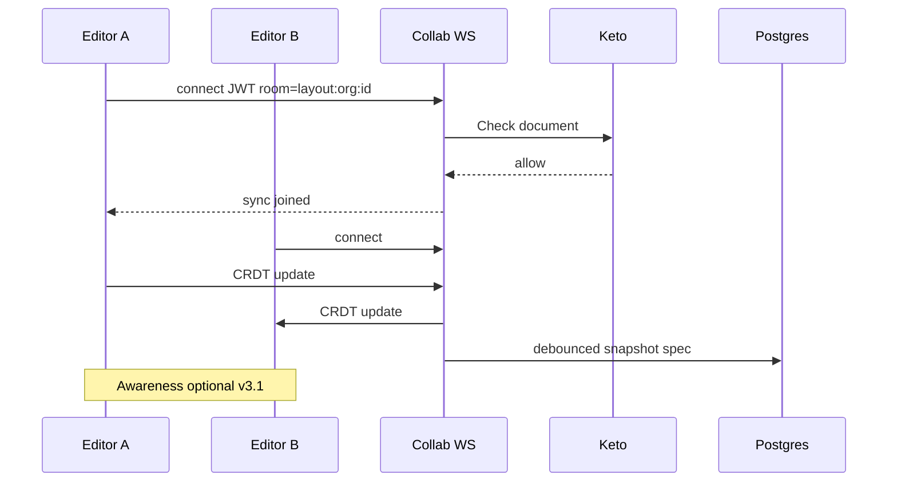

# E3 — Live CRDT collab (implementation guide)

> **Date:** 2026-08-06  
> **Status:** **Live collab shipped** — always on in edit mode  
> **automerge-repo detail:** [`E3-AUTOMERGE-REPO.md`](./E3-AUTOMERGE-REPO.md)
> **Track ID:** **E3** in [`BUILD-MASTER-INDEX.md`](./BUILD-MASTER-INDEX.md)  
> **Supersedes depth:** [`VISUAL-EDITOR-COLLAB-CRDT.md`](../2026-08-01/VISUAL-EDITOR-COLLAB-CRDT.md) (strategy) · this doc is the **OSS cheat sheet + build plan**

---

## Executive summary

**Problem:** Two+ editors on the **same layout draft** at the **same time** — today they only see conflicts at **save** (`If-Match` → 409). E3 adds **live merge + presence** while editing.

**What we edit (two surfaces — do not unify CRDT):**

| Surface | Data | Best CRDT | Why |
|---------|------|-----------|-----|
| **Layout spec** | json-render `{ root, elements }` tree | **Automerge** or **Loro** | JSON/tree CRDTs; not plain text |
| **CMS rich text** (optional, D7) | Long description, HTML-ish | **Yjs** + TipTap/Hocuspocus | Mature text CRDT + editor bindings |

**Recommended stack for noname (self-hosted, Keto-aware):**

```
Layout spec  → Automerge (or Loro spike) + automerge-repo WS adapter + Postgres snapshot
Rich text    → Yjs + Hocuspocus (only if product requires simultaneous long-text edit)
Presence     → Yjs Awareness (text path) · custom presence doc field (Automerge/Loro path)
Auth         → ZITADEL JWT at WS connect · Keto document#edit before room join
Publish      → Unchanged — full validated spec replace (strong convergence boundary)
```

**Do not use:** whole-document Yjs for layout spec ([Yjs #284](https://github.com/yjs/yjs/issues/284) — JSON graph pain). **Defer:** Liveblocks/Tiptap Cloud until self-host path is proven.

---

## Current platform baseline (what E3 builds on)

| Layer | Shipped | E3 uses it |
|-------|---------|------------|
| Solo edit + client undo | ✅ | Keeps local undo; CRDT is cross-tab/live |
| `If-Match` / 409 on layout PUT | ✅ | Publish + fallback save; not live path |
| Keto `Document` / `Collection` edit | ✅ | **Gate WS room** — same as HTTP write guard |
| `document_ops` table | ✅ audit + **JSON Patch payloads (E3-pre)** | Patch log + replay; CRDT blobs in E3a |
| Edge `?edit=true` + `EditPageView` | ✅ | Wire CRDT provider in orchestration hook |
| WebSocket infra | ✅ **E3a v1** | Same-origin WS via edge proxy → API (`proxy-websocket.ts`) |

**E3a v1 code paths (dogfood):**

| Layer | Path |
|-------|------|
| Server collab domain | `packages/server/src/domains/collab/` — ticket, Keto gate, **automerge-repo** room (`Repo` + `LayoutCollabNetworkAdapter`), debounced snapshot |
| WS protocol | **CBOR** automerge-repo messages (binary) + **JSON** presence (text) on same socket |
| WS upgrade | `packages/server/src/index.ts` — `WebSocketServer({ noServer: true })` on `/api/collab/layout/ws` |
| Edge proxy | `packages/workers/src/routes/proxy-websocket.ts` — forwards WS upgrade to `API_ORIGIN` |
| Client hook | `packages/client/src/editor/collab/use-layout-collab.ts` — `Repo` + `LayoutCollabWsAdapter` |
| Orchestration | `packages/client/src/editor/hooks/use-edit-page-orchestration.ts` |
| DnD list ops | `packages/client/src/editor/collab/automerge-spec.ts` — `deleteAt`/`insertAt` for same-parent reorder; `applyLocalSpecToDraft` for props/text |

**Implementer rule:** local layout writes **must** use `handle.change()` (not `handle.update()`) or peers never receive CBOR sync — [`E3-AUTOMERGE-REPO.md` § Local edits](./E3-AUTOMERGE-REPO.md#local-edits-must-use-change-not-update). Incident write-up: [`COLLAB-SYNC-INCIDENT-FIXES.md`](./COLLAB-SYNC-INCIDENT-FIXES.md).

**Try it:** run API (:3000) + edge (:8787) + client (:5173); open same layout with `?edit=true` in two tabs.

**Remaining (not E3a v1):**

| Gap | Notes |
|-----|-------|
| **E3c — Presence / cursors** | **Shipped v1** — peer list, remote selection outline, canvas pointer cursors (`CollabRemoteCursors`) |
| **`automerge-repo`** | **Shipped** — see [`E3-AUTOMERGE-REPO.md`](./E3-AUTOMERGE-REPO.md); client IndexedDB blobs [`COLLAB-BLOB-STORAGE.md`](./COLLAB-BLOB-STORAGE.md) |
| **Reparent list ops** | Cross-parent DnD still uses whole-spec merge (works; list ops optional hardening) |
| **D7 — Rich text collab** | **Shipped v1** — Yjs WS + TipTap `Collaboration` / `CollaborationCursor`; client IndexedDB offline; always on for saved entries |

---

## OSS landscape (cheat sheet)

### Tier A — use for noname E3

| Project | License | Best for | Transport / server | noname fit |
|---------|---------|----------|-------------------|------------|
| **[Automerge](https://automerge.org)** | MIT | JSON / Map / List CRDT | [`automerge-repo`](https://github.com/automerge/automerge-repo) + custom `NetworkAdapter` | **Primary candidate** for layout spec — matches existing docs |
| **[Loro](https://loro.dev)** | Apache 2.0 | JSON + **movable tree** + rich text | Bring your own WS; `LoroDoc.export`/`import` | **Spike alongside Automerge** — `getTree()` fits spec `children` |
| **[Yjs](https://github.com/yjs/yjs)** | MIT | Text / array editing | y-websocket, y-redis, PartyKit | **Rich text only** — TipTap, ProseMirror |
| **[Hocuspocus](https://github.com/ueberdosis/hocuspocus)** | MIT | Yjs WebSocket server | Node; extensions: DB, Redis, webhook auth | **Rich-text collab server** — mirrors our Node stack |
| **[y-partykit](https://docs.partykit.io/reference/y-partykit-api/)** | MIT | Yjs on Cloudflare Workers | Managed edge | Optional if we want edge Yjs without ops |

### Tier B — evaluate later

| Project | Notes |
|---------|-------|
| **[Liveblocks](https://liveblocks.io)** | Fastest product delivery; MAU pricing; Yjs transport option; less ideal for strict self-host + Keto |
| **[PartyKit](https://partykit.io)** | Edge rooms; good for custom protocols; Yjs first-class |
| **[Y-Sweet](https://github.com/jamsocket/y-sweet)** | Open-source Yjs persistence (Jamsocket); alternative to Hocuspocus |
| **[Replicache](https://replicache.dev)** | Local-first sync; different model (mutators); overkill for editor-only |
| **[Electric SQL](https://electric-sql.com)** | Postgres sync; not a CRDT editor layer |

### Tier C — avoid for E3

| Project | Why skip |
|---------|----------|
| **ShareDB / ot.js** | Central OT server; we prefer decentralized CRDT |
| **Whole-spec Yjs** | Constant Y.Map ↔ json-render conversion; merge surprises |
| **Firebase / Supabase realtime** | Wrong abstraction; no spec-tree semantics |

---

## Per-OSS pattern cheat sheet

### Automerge (layout spec)

**Message id analogue:** `Automerge.getHeads(doc)` / binary `save()` blob  
**Sync:** `automerge-repo` sync messages over WebSocket  
**Merge:** Automatic on concurrent Map/List edits — **spike required** on json-render paths (`elements[id].props`, reorder `children`)

| Native concept | Map to noname |
|----------------|---------------|
| `Automerge.init()` | One doc per `layoutId` draft room |
| `doc` as Map/List | Mirror `spec.root`, `spec.elements` |
| `repo.create()` + network | WS room `layout:{orgId}:{layoutId}` |
| `doc` snapshot | Persist to `documents.data.spec` on debounced callback |
| History | Built-in — audit / time-travel optional |

**OSS lessons / mistakes to avoid:**

- Do not mirror entire Postgres row in CRDT — **only `spec` (+ optional content field refs)**
- Automerge 2.x+ fixed perf; still **snapshot often** to cap doc size
- **Publish** must read CRDT → validate `validateSpec` → write published row (do not skip validation)
- Auth: repo must reject sync if Keto `edit` fails — check JWT on WS upgrade

**Refs:** [Automerge tutorial](https://automerge.org/docs/hello/) · [automerge-repo](https://github.com/automerge/automerge-repo)

---

### Loro (layout spec — alternative spike)

**Why consider:** json-render spec is a **tree** (`elements`, `children[]`). Loro has **MovableTree** + fractional indexing (Figma-style ordering) — directly models drag-reorder in canvas.

| Native concept | Map to noname |
|----------------|---------------|
| `doc.getTree("spec")` | Element hierarchy |
| `doc.getMap("elements")` | Flat `elements` record |
| `doc.export()` / `import()` | Postgres snapshot + op log |
| PeerId | `user:{sub}` from ZITADEL |

**Trade-off vs Automerge:** newer ecosystem; fewer production war stories; **better tree move semantics** on paper.

**Refs:** [Loro tree tutorial](https://loro.dev/docs/tutorial/tree) · [GitHub loro-dev/loro](https://github.com/loro-dev/loro)

---

### Yjs + Hocuspocus (rich text only)

**When:** Product needs Google-Docs-style **simultaneous** editing on CMS long-text fields (not layout canvas).

| Provider event | Map to noname |
|--------------|---------------|
| Y.Doc update | Field-scoped room `content:{orgId}:{entryId}:{fieldKey}` |
| `Y.Awareness` | Cursor / “Alice is editing Description” |
| Hocuspocus `onAuthenticate` | JWT + Keto content `edit` |
| Hocuspocus Database extension | Optional persist Y state |

**OSS lessons:**

- One Y.Doc **per field**, not per page — limits blast radius
- Use `@tiptap/extension-collaboration` — do not bind Y.Text to layout spec JSON
- Hocuspocus **debounced** persist hooks → content document row

**Refs:** [Hocuspocus docs](https://tiptap.dev/hocuspocus) · [BlockNote collab providers list](https://www.blocknotejs.org/docs/features/collaboration)

---

### Transport comparison (self-hosted)

| Option | Pros | Cons | noname pick |
|--------|------|------|-------------|
| **Hocuspocus** | Yjs-native, auth hooks, Redis/DB extensions | Yjs-only | Rich text |
| **automerge-repo WS** | Automerge-native | Roll our own persistence | Layout spec |
| **PartyKit + y-partykit** | Edge, fast to demo | CF dependency; less Keto integration patterns | Dev spike only |
| **Liveblocks** | Presence, comments, storage | SaaS cost; compliance | Later if speed > control |
| **Raw WS in workers** | Full control | Reinvent sync protocol | Only if repo adapters fail |

---

## Build vs buy

| Approach | Time to MVP | Control | Fits Keto/ZITADEL | Recommendation |
|----------|-------------|---------|-------------------|----------------|
| **Automerge + own WS** | Medium | High | Excellent | **Default for layout** |
| **Loro + own WS** | Medium | High | Excellent | **Parallel spike** |
| **Hocuspocus (self-host)** | Low–medium | High | Good (auth hook) | **Rich text when asked** |
| **Liveblocks** | Low | Medium | Good (custom auth) | Prototype only / agency tier |
| **100% custom CRDT** | Very high | Total | N/A | **Never** |

---

## Recommended E3 phases (implementation order)

Aligns with [`VISUAL-EDITOR-IMPLEMENTATION-ORDER.md`](../2026-07-25/VISUAL-EDITOR-IMPLEMENTATION-ORDER.md) steps 6–10.

### E3-pre — Op log with patches (v2, still required)

**Before live CRDT**, extend `document_ops`:

- Payload: JSON Patch (`fast-json-patch`) or dot-path ops
- Dedup: `(client_id, client_seq)` unique
- Enables audit, cross-device history, CRDT snapshot audit trail

**Acceptance:** Replay ops on snapshot reproduces spec; no live WS yet.

---

### E3-spike — Offline merge proof (1–2 weeks)

**Goal:** Prove two editors can edit different spec paths offline and converge.

| Task | Automerge | Loro |
|------|-----------|------|
| Import published spec into CRDT doc | ✓ | ✓ |
| Simulate edit A: change `Hero.title` | ✓ | ✓ |
| Simulate edit B: add `Section` child | ✓ | ✓ |
| Merge → `toJSON()` | Must match golden | Must match golden |
| Run through `validateSpec` | Must pass | Must pass |

**Pick winner** by: merge correctness on `children` reorder, bundle size, DX.

---

### E3a — Live layout collab (core E3)



| Component | Detail |
|-----------|--------|
| **Room key** | `layout:{orgId}:{layoutDocumentId}` |
| **Auth** | Same JWT as API; `onAuthenticate` → Keto `edit` on document |
| **Client** | `useEditPageOrchestration` subscribes to CRDT; local edits → CRDT; CRDT remote → canvas |
| **Snapshot** | Every N sec or last-leave → `documents.data.spec` + bump `updatedAt` |
| **Publish** | Read CRDT snapshot → existing publish path (validation + Keto `publish`) |
| **Fallback** | If WS down → solo mode + 409 on save (current behavior) |

**Acceptance:**

- Two browsers edit same layout; changes appear < 500ms without save
- Refresh restores from CRDT snapshot
- Publish produces same result as solo edit
- User without Keto `edit` cannot join room

---

### E3b — Rich text collab (optional)

Only if D7 inline rich text + simultaneous edit is a requirement.

- Hocuspocus server (or sidecar process)
- Room per content field
- TipTap collab extension in content editor component
- **Do not** merge into layout Automerge doc

---

### E3c — Presence polish

- Layout: lightweight presence (user list, selected element id) — can use separate Yjs Awareness doc or small Automerge map `{ peerId → { userId, selection } }`
- Avoid blocking E3a on fancy cursors

---

## Feature matrix (what OSS gives “for free”)

| Feature | Automerge | Loro | Yjs+Hocuspocus | Liveblocks |
|---------|-----------|------|----------------|------------|
| Concurrent edit merge | ✅ | ✅ | ✅ (text) | ✅ |
| Offline → online merge | ✅ | ✅ | ✅ (y-indexeddb) | ✅ |
| Undo/redo across peers | ✅ history | ✅ time travel | UndoManager | ✅ |
| Presence / cursors | ❌ DIY | ❌ DIY | ✅ Awareness | ✅ |
| Comments | ❌ | ❌ | ❌ | ✅ |
| Tree move / reorder | ⚠️ List ops | ✅ MovableTree | ❌ | ⚠️ |
| Self-host | ✅ | ✅ | ✅ | ⚠️ hybrid |
| Postgres persist | DIY hook | DIY export | Hocuspocus ext | Hosted |

---

## Pitfalls (learned from OSS implementations)

| Mistake | Seen in | noname rule |
|---------|---------|-------------|
| Yjs on entire app state | Many demos | **Spec CRDT ≠ text CRDT** |
| No auth on WS rooms | y-websocket demos | **Keto before join** |
| CRDT snapshot = publish | Automerge demos | **Always validateSpec on publish** |
| Giant CRDT doc never compacted | Long-lived docs | Snapshot + trim history |
| Collab before ACL stable | Startups | Keto folders done — **E3a v1 uses same `document#edit` gate** |
| Replacing client undo with CRDT | Confusion | Keep session undo; CRDT for multi-peer |
| Content PUT without If-Match | Our gap | Add optimistic lock on content before E3b |
| Agent + human live merge | Agent plan | Agents use **sequential** ops (A′), not CRDT v1 |

---

## Integration with noname domains

| Domain | E3 touch |
|--------|----------|
| **documents** | Snapshot target; publish unchanged semantics |
| **edge** | Same-origin WS via worker proxy → API (`proxy-websocket.ts`) |
| **auth / Keto** | WS auth middleware mirrors `document-write-guard.ts` |
| **workers** | Public WS route pattern (like comms webhooks) — **authenticated** |
| **agents** | E3e: agent as full WS collab peer — [`E3e-AGENT-FULL-COLLAB-PEER.md`](./E3e-AGENT-FULL-COLLAB-PEER.md). **Do not** HTTP+CRDT hybrid on live path — see E3e pitfalls. |
| **analytics** | Do not stream CRDT ops to ClickHouse — product analytics separate |

---

## Open decisions (resolve in spike)

1. ~~**Automerge vs Loro**~~ — **Automerge primary** ([`E3-SPIKE-REPORT.md`](./E3-SPIKE-REPORT.md))
2. ~~**Collab service placement**~~ — **v1:** collab routes on existing API server; edge proxies WS
3. ~~**Snapshot frequency**~~ — **5s debounce** in `layout-room.ts`
4. **Content fields in layout collab** — bind `$state` refs only vs include inline strings in CRDT
5. **E3b gate** — is simultaneous rich-text edit actually requested? (D7 track)

---

## Suggested next PR slices

1. **E3c** — presence map (peer list + selected element id) — **done**
2. ~~**`automerge-repo`**~~ — **done** — [`E3-AUTOMERGE-REPO.md`](./E3-AUTOMERGE-REPO.md)
3. **Durable blob storage** — client IndexedDB + **server Postgres shipped** — [`COLLAB-BLOB-STORAGE.md`](./COLLAB-BLOB-STORAGE.md)
4. **Reparent list ops** — multi-list `deleteAt`/`insertAt` when DnD moves across parents
5. **Prod edge validation** — Cloudflare WS upgrade on deployed worker

~~First PR slice (when gate opens)~~ — **Done in E3a v1** (see table above).

---

## Doc map

| Question | Read |
|----------|------|
| Spike results | [`E3-SPIKE-REPORT.md`](./E3-SPIKE-REPORT.md) |
| Strategy (historical) | [`VISUAL-EDITOR-COLLAB-CRDT.md`](../2026-08-01/VISUAL-EDITOR-COLLAB-CRDT.md) |
| Setup examples | [`COLLAB-EDITOR-SETUP.md`](../2026-08-01/COLLAB-EDITOR-SETUP.md) |
| Rich text (separate track) | [`RICH-TEXT-IMPLEMENTATION.md`](./RICH-TEXT-IMPLEMENTATION.md) |
| Patch / merge storage | [`SPEC-STORAGE-MERGE.md`](../2026-07-25/SPEC-STORAGE-MERGE.md) |
| Build index E3 row | [`BUILD-MASTER-INDEX.md`](./BUILD-MASTER-INDEX.md) |
