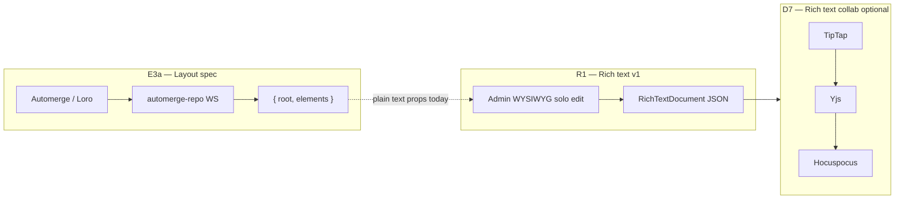

# E3-spike report — Automerge vs Loro (layout spec)

> **Status:** Complete (offline spike; script removed after doc capture)  
> **Scope:** **Layout spec only** — `{ root, elements }` json-render tree  
> **Out of scope:** CMS **rich text** fields → see [`RICH-TEXT-IMPLEMENTATION.md`](./RICH-TEXT-IMPLEMENTATION.md) (R1 + D7 Yjs)

**Ran:** 2026-08-06T14:57:51.442Z  
**Fixtures:** Seed layouts `home`, `commerce` (real spec shapes)  
**Handoff spec:** [`E3-SPIKE-HANDOFF.md`](./E3-SPIKE-HANDOFF.md)

---

## Recommendation (E3a)

| Role | Library | Use when |
|------|---------|----------|
| **Primary** | **Automerge** | Live layout spec collab — Map/List mirror of `spec.elements` |
| **Fallback** | **Loro** | If movable-tree / DnD ergonomics outweigh Automerge list ops |

**Rich text:** **Neither.** Do not put `RichTextDocument` in Automerge. Long-form CMS fields stay on **Yjs + TipTap** (D7) if live collab is ever required.

---

## Full PASS/FAIL matrix

### Scenario results

| # | Scenario | Fixture | Automerge | Loro | `validateSpec` on export | Notes |
|---|----------|---------|-----------|------|--------------------------|-------|
| 1 | **Concurrent prop edit** — Alice `hero.props.title`, Bob `hero.props.subtitle` | commerce | **PASS** | **PASS** | **PASS** | Both props present after merge |
| 2 | **Reorder children** — Alice reorders `grid.children`, Bob adds sibling | commerce | **PASS** | **PASS** | **PASS** | Loro `MovableList` feels more natural for DnD |
| 3 | **Add + delete element** — Alice adds `banner`, Bob removes unrelated `footer` | home | **PASS** | **PASS** | **PASS** | No lost nodes |
| 4 | **Publish boundary** — export → server `validateSpec()` | both | **PASS** | **PASS** | **PASS** | Same gate as HTTP publish today |

**Summary:** Automerge **3/3** scenarios; Loro **3/3**. No failures on either library.

### Merge timing (ms, offline fork + merge)

| Scenario | Automerge | Loro |
|----------|-----------|------|
| concurrent_prop_edit | 34.99 | 21.13 |
| reorder_children | 5.90 | 3.61 |
| add_delete_element | 3.53 | 2.63 |

Loro was faster in this spike; difference is not decisive vs ecosystem/API preference.

### Doc size after 50 sequential prop edits (commerce hero title)

| Library | Bytes |
|---------|-------|
| Automerge | **1803** |
| Loro | 2522 |

Automerge produced a smaller snapshot for this edit pattern.

---

## E3-pre patch replay vs CRDT convergence

E3-pre already ships ordered **RFC 6902** patches in `document_ops` + `replaySpecPatches()`. The spike compared naive ordered replay against CRDT merge on the same fixtures.

| Scenario | CRDT (both libs) | Ordered patch replay = golden? | Notes |
|----------|------------------|----------------------------------|-------|
| concurrent_prop_edit | PASS | **YES** | Independent paths commute |
| reorder_children | PASS | **NO** | Same-base patch replay diverges; **CRDT converges** where naive replay does not |
| add_delete_element | PASS | **YES** | — |

**Implication:** The op log remains the **audit trail** and offline fallback, but **live collab** needs a CRDT (or CRDT-backed sync), not replay-alone, especially for reorder + concurrent structural edits.

---

## Why E3a is more work than E3-pre (custom adapter)

E3-pre is **concise** — already shipped:

- HTTP save → diff → JSON Patch → append `document_ops` row  
- Client sends `X-Client-Id` / `X-Client-Seq` for dedup  
- `GET /document/:id/ops` for timeline / replay  

E3a adds a **custom Automerge adapter** between json-render and the CRDT. That layer is **not** a thin wrapper:

| Concern | E3-pre (patch log) | E3a (Automerge live) |
|---------|-------------------|----------------------|
| Edit surface | Existing React editor mutates spec object | Every spec mutation → Automerge op (`splice`, `put`, `deleteAt`) |
| `children` arrays | RFC 6902 `move` / replace | Must use **list ops** — never assign `children = [...]` wholesale during live session |
| Presence / cursors | N/A | Custom presence doc or parallel channel |
| Transport | HTTP | **New** WS — `automerge-repo` + Keto gate on join |
| Persistence | Postgres spec row + ops | CRDT snapshot blob + ops audit |
| Publish | Full spec replace | Export Automerge → `validateSpec` → same publish boundary |
| Rich text in spec props | Plain strings today | **Out of scope** — use CMS `richText` field (R1), not Automerge text |

**Bottom line:** Ship and use E3-pre for audit/replay/409 recovery. Budget E3a as a **multi-week adapter + sync service**, not a library swap.

### E3a schema mapping (codify before coding)

**Automerge (primary):**

- `spec.root` → scalar / small map on doc root  
- `spec.elements` → `Map<elementId, ElementRecord>`  
- `ElementRecord.children` → **List** — `insertAt` / `deleteAt` / `splice` only  
- `props` / `labels` → nested Map per element  

**Loro (fallback):**

- `spec.elements` → `LoroMap`  
- `element.children` → **`LoroMovableList`** (nice fit for canvas DnD)  
- Export via `doc.export()` → validate → publish  

**Publish boundary (unchanged):** CRDT export → `validateSpec()` → full spec replace to Postgres. CRDT is the **live editing** path; Postgres published row stays authoritative for storefront reads.

---

## Two CRDT tracks — do not merge

| Track | ID | Data | CRDT | Status |
|-------|-----|------|------|--------|
| Layout live collab | **E3a** | json-render spec | Automerge → Loro fallback | **v1 dogfood** — `?collab=1`, edge WS proxy, list ops for reorder |
| Rich text solo | **R1** | `documents.data` field | None (HTTP save) | **Not started** — [`RICH-TEXT-IMPLEMENTATION.md`](./RICH-TEXT-IMPLEMENTATION.md) |
| Rich text live collab | **D7** | Same JSON tree | Yjs + Hocuspocus | Deferred until product asks |

---

## Rationale detail

1. **Both libraries passed** all structural scenarios on real seed specs.  
2. **Automerge wins primary** on doc size in the 50-edit benchmark and matches existing architecture docs (`VISUAL-EDITOR-COLLAB-CRDT.md`, `PERMISSIONS-OSS-REFERENCES.md`).  
3. **Loro stays fallback** if team prefers `MovableList` for reorder during E3a prototyping.  
4. **Reorder is the hard case** for patch replay — validates investing in CRDT for live editing, not for rich text.  
5. **Rich text is a separate product surface** — today editors paste plain text into layout `longText` props; CMS `richText` fields are not wired in UI at all ([`RICH-TEXT-IMPLEMENTATION.md`](./RICH-TEXT-IMPLEMENTATION.md)).

---

## Surprises / failures

None — all scenarios passed on both libraries.

---

## E3a entry checklist

- [x] E3-pre merged and stable (`document_ops`, client op headers, ops list API)  
- [x] Spike recommendation accepted (this doc)  
- [x] Automerge ↔ spec adapter (mapping above) — v1 merge + list ops for reorder  
- [x] WS auth + Keto gate + manual Automerge sync relay  
- [x] Wire provider in `use-edit-page-orchestration.ts` (`?collab=1`)  
- [x] Snapshot persistence (debounced → `layout.update`)  
- [x] Edge WS proxy (same-origin; no direct `:3000` bypass)  
- [x] **`automerge-repo`** network adapter — [`E3-AUTOMERGE-REPO.md`](./E3-AUTOMERGE-REPO.md)  
- [x] **E3c** presence / cursors  
- [ ] Publish export path validation in prod  
- [ ] **Do not** start Yjs/Hocuspocus for layout  
- [ ] **Do not** block on R1 rich text  

---

## How this was produced

Offline spike (Aug 2026): four scenarios on real `home` + `commerce` seed specs. Compared Automerge vs Loro merge, `validateSpec` on export, and E3-pre `replaySpecPatches()` from `document-op-payload.ts`. Spike script lived under `packages/server/.../collab-spike/` during the run; removed after this report was captured.

**Re-run (optional):** restore spike from git history or re-scaffold from [`E3-SPIKE-HANDOFF.md`](./E3-SPIKE-HANDOFF.md); `pnpm add -D @automerge/automerge loro-crdt --filter @noname/server`.
